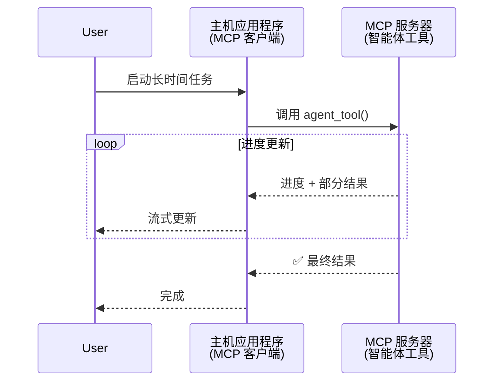
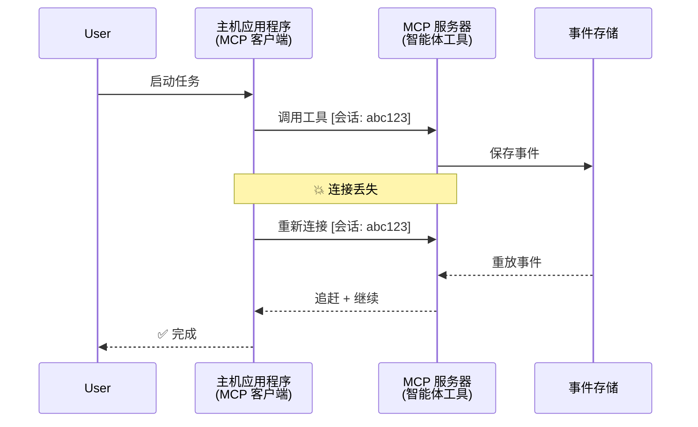
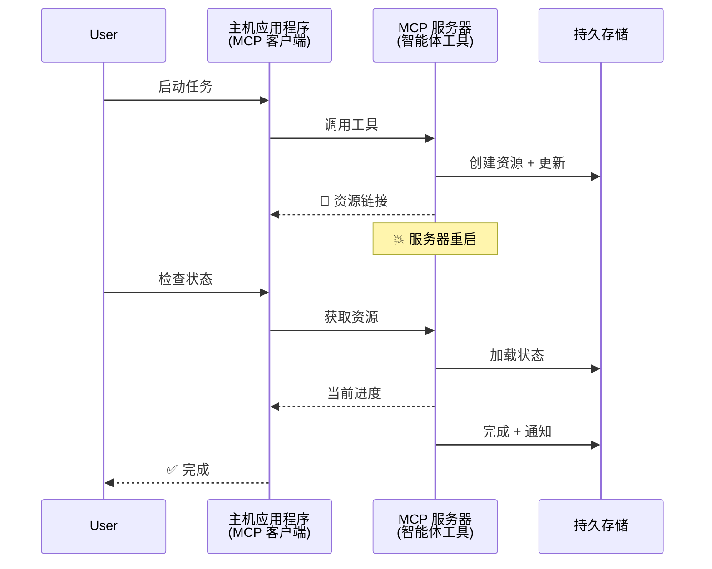
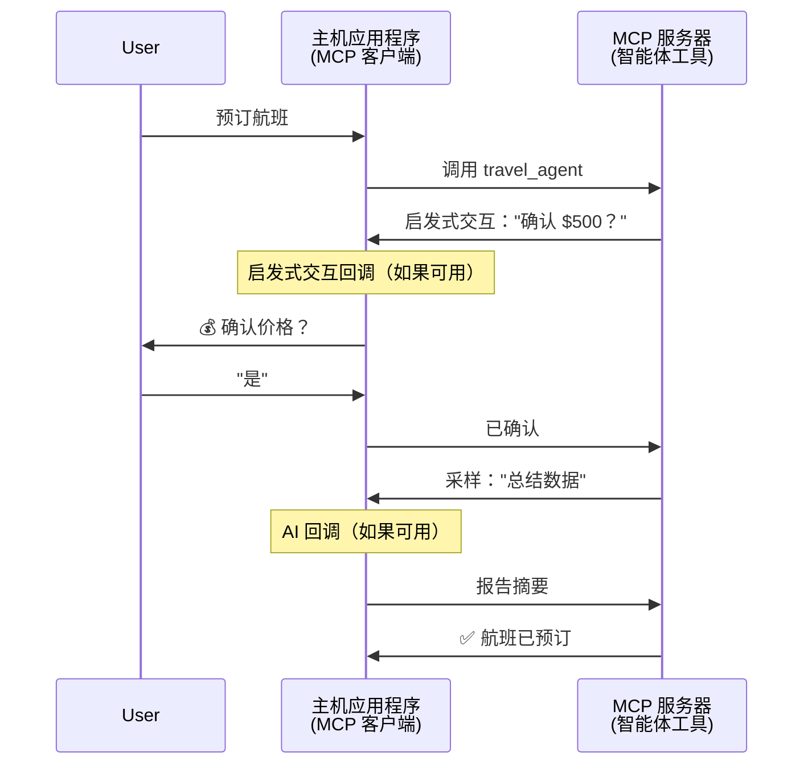

# 使用 MCP 构建智能体到智能体通信系统

> TL;DR - 你能在 MCP 上构建智能体到智能体通信吗？可以！

MCP 已经显著超越了其最初"为 LLM 提供上下文"的目标。通过最近的增强功能，包括[可恢复流](https://modelcontextprotocol.io/docs/concepts/transports#resumability-and-redelivery)、[启发式交互](https://modelcontextprotocol.io/specification/2025-06-18/client/elicitation)、[采样](https://modelcontextprotocol.io/specification/2025-06-18/client/sampling)和通知（[进度](https://modelcontextprotocol.io/specification/2025-06-18/basic/utilities/progress)和[资源](https://modelcontextprotocol.io/specification/2025-06-18/schema#resourceupdatednotification)），MCP 现在为构建复杂的智能体到智能体通信系统提供了坚实的基础。

## 智能体/工具的误解

随着越来越多的开发者探索具有智能体行为的工具（长时间运行、可能需要在执行过程中需要额外输入等），一个常见的误解是 MCP 不适合，主要是因为其早期示例中的工具主要关注简单的请求-响应模式。

这种观念已经过时了。在过去几个月中，MCP 规范已经显著增强，增加了支持构建长时间运行的智能体行为的能力：

- **流式传输和部分结果**：执行期间的实时进度更新
- **可恢复性**：客户端可以在断开连接后重新连接并继续
- **持久性**：结果在服务器重启后仍然存在（例如，通过资源链接）
- **多轮交互**：通过启发式交互和采样在执行过程中进行交互式输入

这些功能可以组合起来，以实现复杂的智能体和多智能体应用，全部部署在 MCP 协议上。

作为参考，我们将智能体称为 MCP 服务器上可用的"工具"。这意味着存在一个实现 MCP 客户端的主机应用程序，该客户端与 MCP 服务器建立会话并可以调用智能体。

## 是什么让 MCP 工具具有"智能体"特征？

在深入实现之前，让我们确定支持长时间运行的智能体需要哪些基础设施能力。

> 我们将智能体定义为一个可以在长时间内自主运行的实体，能够处理可能需要基于实时反馈进行多次交互或调整的复杂任务。

### 1. 流式传输和部分结果

传统的请求-响应模式不适用于长时间运行的任务。智能体需要提供：

- 实时进度更新
- 中间结果

**MCP 支持**：资源更新通知可以实现流式传输部分结果，尽管这需要仔细设计以避免与 JSON-RPC 的 1:1 请求/响应模型冲突。

| 功能                    | 用例                                                                                                                                                                       | MCP 支持                                                                                |
| -------------------------- | ------------------------------------------------------------------------------------------------------------------------------------------------------------------------------ | ------------------------------------------------------------------------------------------ |
| 实时进度更新 | 用户请求代码库迁移任务。智能体流式传输进度："10% - 分析依赖... 25% - 转换 TypeScript 文件... 50% - 更新导入..."          | ✅ 进度通知                                                                  |
| 部分结果            | "生成一本书"任务流式传输部分结果，例如，1) 故事大纲，2) 章节列表，3) 每章完成时。主机可以在任何阶段检查、取消或重定向。 | ✅ 通知可以"扩展"以包含部分结果，参见 PR 383、776 的提案 |

<div align="center" style="font-style: italic; font-size: 0.95em; margin-bottom: 0.5em;">
<strong>图 1：</strong>此图说明了 MCP 智能体如何在长时间运行的任务期间向主机应用程序流式传输实时进度更新和部分结果，使用户能够实时监控执行情况。
</div>



### 2. 可恢复性

智能体必须优雅地处理网络中断：

- 在（客户端）断开连接后重新连接
- 从中断的地方继续（消息重新传递）

**MCP 支持**：MCP StreamableHTTP 传输目前支持会话恢复和消息重新传递，使用会话 ID 和最后事件 ID。这里的重要说明是，服务器必须实现一个 EventStore，以便在客户端重新连接时重放事件。
注意，有一个社区提案（PR #975）探索了与传输无关的可恢复流。

| 功能      | 用例                                                                                                                                                   | MCP 支持                                                                |
| ------------ | ---------------------------------------------------------------------------------------------------------------------------------------------------------- | -------------------------------------------------------------------------- |
| 可恢复性 | 客户端在长时间运行的任务期间断开连接。重新连接后，会话恢复并重放错过的事件，从中断的地方无缝继续。 | ✅ StreamableHTTP 传输，支持会话 ID、事件重放和 EventStore |

<div align="center" style="font-style: italic; font-size: 0.95em; margin-bottom: 0.5em;">
<strong>图 2：</strong>此图显示了 MCP 的 StreamableHTTP 传输和事件存储如何实现无缝会话恢复：如果客户端断开连接，它可以重新连接并重放错过的事件，继续任务而不会丢失进度。
</div>



### 3. 持久性

长时间运行的智能体需要持久状态：

- 结果在服务器重启后仍然存在
- 可以带外检索状态
- 跨会话的进度跟踪

**MCP 支持**：MCP 现在支持工具调用的资源链接返回类型。目前，一种可能的模式是设计一个创建资源并立即返回资源链接的工具。该工具可以在后台继续处理任务并更新资源。反过来，客户端可以选择轮询此资源的状态以获取部分或完整结果（基于服务器提供的资源更新）或订阅资源以获取更新通知。

这里的一个限制是，轮询资源或订阅更新可能会消耗资源，并在规模上产生影响。有一个开放的社区提案（包括 #992）探索了包含服务器可以调用来通知客户端/主机应用程序更新的 webhooks 或触发器的可能性。

| 功能    | 用例                                                                                                                                        | MCP 支持                                                        |
| ---------- | ----------------------------------------------------------------------------------------------------------------------------------------------- | ------------------------------------------------------------------ |
| 持久性 | 服务器在数据迁移任务期间崩溃。结果和进度在重启后仍然存在，客户端可以检查状态并从持久资源继续。 | ✅ 资源链接，支持持久存储和状态通知 |

目前，一种常见的模式是设计一个创建资源并立即返回资源链接的工具。该工具可以在后台处理任务，发出作为进度更新或包含部分结果的资源通知，并根据需要更新资源中的内容。

<div align="center" style="font-style: italic; font-size: 0.95em; margin-bottom: 0.5em;">
<strong>图 3：</strong>此图演示了 MCP 智能体如何使用持久资源和状态通知来确保长时间运行的任务在服务器重启后仍然存在，允许客户端即使在故障后也能检查进度并检索结果。
</div>



### 4. 多轮交互

智能体经常需要在执行过程中需要额外输入：

- 人类澄清或批准
- AI 辅助进行复杂决策
- 动态参数调整

**MCP 支持**：通过采样（用于 AI 输入）和启发式交互（用于人类输入）完全支持。

| 功能                 | 用例                                                                                                                                     | MCP 支持                                           |
| ----------------------- | -------------------------------------------------------------------------------------------------------------------------------------------- | ----------------------------------------------------- |
| 多轮交互 | 旅行预订智能体请求用户确认价格，然后要求 AI 在完成预订交易之前总结旅行数据。 | ✅ 用于人类输入的启发式交互，用于 AI 输入的采样 |

<div align="center" style="font-style: italic; font-size: 0.95em; margin-bottom: 0.5em;">
<strong>图 4：</strong>此图描绘了 MCP 智能体如何在执行过程中交互地启发人类输入或请求 AI 辅助，支持复杂的多轮工作流程，例如确认和动态决策。
</div>



## 在 MCP 上实现长时间运行的智能体 - 代码概述

作为本文的一部分，我们提供了一个[代码仓库](https://github.com/victordibia/ai-tutorials/tree/main/MCP%20Agents)，其中包含使用 MCP Python SDK 和 StreamableHTTP 传输进行会话恢复和消息重新传递的长时间运行的智能体的完整实现。该实现演示了如何组合 MCP 功能以实现复杂的类似智能体的行为。

具体来说，我们实现了一个具有两个主要智能体工具的服务器：

- **旅行智能体** - 模拟旅行预订服务，通过启发式交互进行价格确认
- **研究智能体** - 执行研究任务，通过采样进行 AI 辅助摘要

两个智能体都演示了实时进度更新、交互式确认和完整的会话恢复能力。

### 关键实现概念

以下部分显示了每个功能的服务器端智能体实现和客户端主机处理：

#### 流式传输和进度更新 - 实时任务状态

流式传输使智能体能够在长时间运行的任务期间提供实时进度更新，让用户了解任务状态和中间结果。

**服务器实现（智能体发送进度通知）：**

```python
# 来自 server/server.py - 旅行智能体发送进度更新
for i, step in enumerate(steps):
    await ctx.session.send_progress_notification(
        progress_token=ctx.request_id,
        progress=i * 25,
        total=100,
        message=step,
        related_request_id=str(ctx.request_id)
    )
    await anyio.sleep(2)  # 模拟工作

# 替代方案：记录消息以获得详细的逐步更新
await ctx.session.send_log_message(
    level="info",
    data=f"正在处理步骤 {current_step}/{steps} ({progress_percent}%)",
    logger="long_running_agent",
    related_request_id=ctx.request_id,
)
```

**客户端实现（主机接收进度更新）：**

```python
# 来自 client/client.py - 客户端处理实时通知
async def message_handler(message) -> None:
    if isinstance(message, types.ServerNotification):
        if isinstance(message.root, types.LoggingMessageNotification):
            console.print(f"📡 [dim]{message.root.params.data}[/dim]")
        elif isinstance(message.root, types.ProgressNotification):
            progress = message.root.params
            console.print(f"🔄 [yellow]{progress.message} ({progress.progress}/{progress.total})[/yellow]")

# 创建会话时注册消息处理程序
async with ClientSession(
    read_stream, write_stream,
    message_handler=message_handler
) as session:
```

#### 启发式交互 - 请求用户输入

启发式交互使智能体能够在执行过程中请求用户输入。这对于长时间运行任务期间的确认、澄清或批准至关重要。

**服务器实现（智能体请求确认）：**

```python
# 来自 server/server.py - 旅行智能体请求价格确认
elicit_result = await ctx.session.elicit(
    message=f"请确认前往 {destination} 的旅行估计价格 $1200",
    requestedSchema=PriceConfirmationSchema.model_json_schema(),
    related_request_id=ctx.request_id,
)

if elicit_result and elicit_result.action == "accept":
    # 继续预订
    logger.info(f"用户确认价格: {elicit_result.content}")
elif elicit_result and elicit_result.action == "decline":
    # 取消预订
    booking_cancelled = True
```

**客户端实现（主机提供启发式交互回调）：**

```python
# 来自 client/client.py - 客户端处理启发式交互请求
async def elicitation_callback(context, params):
    console.print(f"💬 服务器正在请求确认：")
    console.print(f"   {params.message}")

    response = console.input("你接受吗？(y/n): ").strip().lower()

    if response in ['y', 'yes']:
        return types.ElicitResult(
            action="accept",
            content={"confirm": True, "notes": "用户已确认"}
        )
    else:
        return types.ElicitResult(
            action="decline",
            content={"confirm": False, "notes": "用户已拒绝"}
        )

# 创建会话时注册回调
async with ClientSession(
    read_stream, write_stream,
    elicitation_callback=elicitation_callback
) as session:
```

#### 采样 - 请求 AI 辅助

采样允许智能体在执行过程中请求 LLM 辅助进行复杂决策或内容生成。这实现了混合的人工智能工作流程。

**服务器实现（智能体请求 AI 辅助）：**

```python
# 来自 server/server.py - 研究智能体请求 AI 摘要
sampling_result = await ctx.session.create_message(
    messages=[
        SamplingMessage(
            role="user",
            content=TextContent(type="text", text=f"请总结关于以下研究的关键发现：{topic}")
        )
    ],
    max_tokens=100,
    related_request_id=ctx.request_id,
)

if sampling_result and sampling_result.content:
    if sampling_result.content.type == "text":
        sampling_summary = sampling_result.content.text
        logger.info(f"收到采样摘要: {sampling_summary}")
```

**客户端实现（主机提供采样回调）：**

```python
# 来自 client/client.py - 客户端处理采样请求
async def sampling_callback(context, params):
    message_text = params.messages[0].content.text if params.messages else '无消息'
    console.print(f"🧠 服务器请求采样: {message_text}")

    # 在实际应用程序中，这可以调用 LLM API
    # 对于演示目的，我们提供模拟响应
    mock_response = "根据当前研究，MCP 已经显著发展..."

    return types.CreateMessageResult(
        role="assistant",
        content=types.TextContent(type="text", text=mock_response),
        model="interactive-client",
        stopReason="endTurn"
    )

# 创建会话时注册回调
async with ClientSession(
    read_stream, write_stream,
    sampling_callback=sampling_callback,
    elicitation_callback=elicitation_callback
) as session:
```

#### 可恢复性 - 跨断开连接的会话连续性

可恢复性确保长时间运行的智能体任务可以在客户端断开连接后仍然存在，并在重新连接时无缝继续。这是通过事件存储和恢复令牌实现的。

**事件存储实现（服务器保存会话状态）：**

```python
# 来自 server/event_store.py - 简单的内存事件存储
class SimpleEventStore(EventStore):
    def __init__(self):
        self._events: list[tuple[StreamId, EventId, JSONRPCMessage]] = []
        self._event_id_counter = 0

    async def store_event(self, stream_id: StreamId, message: JSONRPCMessage) -> EventId:
        """存储事件并返回其 ID。"""
        self._event_id_counter += 1
        event_id = str(self._event_id_counter)
        self._events.append((stream_id, event_id, message))
        return event_id

    async def replay_events_after(self, last_event_id: EventId, send_callback: EventCallback) -> StreamId | None:
        """重放指定 ID 之后的事件以进行恢复。"""
        # 找到最后已知事件之后的事件并重放它们
        for _, event_id, message in self._events[start_index:]:
            await send_callback(EventMessage(message, event_id))

# 来自 server/server.py - 将事件存储传递给会话管理器
def create_server_app(event_store: Optional[EventStore] = None) -> Starlette:
    server = ResumableServer()

    # 创建带有事件存储的会话管理器以进行恢复
    session_manager = StreamableHTTPSessionManager(
        app=server,
        event_store=event_store,  # 事件存储启用会话恢复
        json_response=False,
        security_settings=security_settings,
    )

    return Starlette(routes=[Mount("/mcp", app=session_manager.handle_request)])

# 使用：使用事件存储初始化
event_store = SimpleEventStore()
app = create_server_app(event_store)
```

**带有恢复令牌的客户端元数据（客户端使用存储的状态重新连接）：**

```python
# 来自 client/client.py - 带有元数据的客户端恢复
if existing_tokens and existing_tokens.get("resumption_token"):
    # 使用现有的恢复令牌从中断的地方继续
    metadata = ClientMessageMetadata(
        resumption_token=existing_tokens["resumption_token"],
    )
else:
    # 创建回调以在收到恢复令牌时保存
    def enhanced_callback(token: str):
        protocol_version = getattr(session, 'protocol_version', None)
        token_manager.save_tokens(session_id, token, protocol_version, command, args)

    metadata = ClientMessageMetadata(
        on_resumption_token_update=enhanced_callback,
    )
```